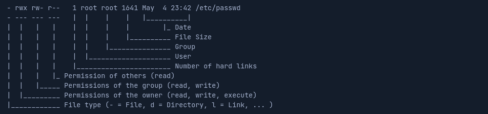

# Linux


- __Дистрибутивы Линукс__: (distros) ОС, основанные на ядре Линукс (Например, Ubuntu, Fedora, CentOS, Red Hat, Debian). Используются в серверах, встроенных устройствах, настольных ПК, мобильных устройствах, облачных вычислениях;
- Распространенные дистрибутивы в кибербезопасности: ParrotOS, Raspberry Pi OS, BlackArch, Ubuntu, CentOS, Pentoo, Debian, Backbox;
- Основные различия дистрибутивов: включенные пакеты, пользовательский интерфейс, доступные инструменты;


## Философия

- __Все есть файл__
- __Содержит множество небольших программ__
- __Возможность объединения программ для выполнения сложных задач__
- __Не привязан к GUI__
- __Данные конфигураций хранятся в текстовых файлах__


## Компоненты

- __Bootloader__: Загрузчик управляет процессом загрузки ОС (Например, GRUB);
- __OS Kernel__: Код ядра управляет ресурсами системных устройств ввода-вывода на аппаратном уровне;
- __Daemons__: Фоновые службы обеспечивают правильную работу функций (Например, печать, планирование, мультимедиа);
- __OS Shell__: Интерфейс между пользователем и ОС (Например, Bash, Tcsh/Csh, Ksh, Zsh, Fish);
- __Graphics server__: Обеспечивает графическую подсистему X-server, которая позволяет графическим программам запускаться локально или удаленно в системе X-windowing;
- __Window manager__: GUI позволяет пользователю получать доступ к основным функциям и службам ОС (Например, GNOME, KDE, Mate, Unity, Cinnamon);
- __Utilities__: Программы выполняют определенные функции для пользователей или других программ.


## Архитектура

- __Hardware__: Аппаратное обеспечение, периферийные устройства (Например, CPU, RAM, жесткий диск);
- __Kernel__: Ядро предоставляет каждому процессу собственные виртуальные ресурсы и предотвращает конфликты между различными процессами;
- __Shell__: Интерфейс командной строки (Command-line interface, CLI) позволяет пользователю вводить команды для выполнения функций ядра;
- __System utility__: Предоставляет пользователю все функциональные возможности ОС.


## Архитектура файловой системы

- __/__: Директория верхнего уровня является корневой файловой системой и содержит все файлы, необходимые для загрузки ОС до монтирования других файловых систем, а также файлы, необходимые для загрузки других файловых систем. После загрузки все остальные файловые системы монтируются в стандартные точки монтирования как подкатологи корня;
- __bin__: Двоичные файлы многих основных программ, которые должны присутствовать при монтировании системы;
- __sbin__: Исполняемые файлы, используемые для системного администрирования;
- __boot__: Файлы для загрузки системы (Статический загрузчик, исполняемый файл ядра и файлы, необходимые для загрузки ОС);
- __dev__: Файлы устройств для облегчения доступа к каждому аппаратному устройству, подключенному к системе;
- __etc__: Файлы конфигурации локальной системы и установленных приложений (Например, файл паролей или файлы настроек сетей);
- __home__: Домашний каталог пользователей;
- __lib__: Файлы библиотек, необходимые двоичным файлам в каталогах bin, sbin для загрузки системы;
- __media__: Место монитрования внешних съемных носителей (Например, USB drives);
- __mnt__: Временная точка монтирования для обычных файловых систем. Используется администратором системы для ручного монтирования файловых систем;
- __opt__: Используется проприентарным ПО для хранения дополнительных пакетов ПО;
- __proc__: Автоматически сгенерированные файлы системы, которые содержат информацию о запущенных процессах и состоянии ядра;
	- __proc/cpuinfo__: Информация о процессоре;
	- __proc/interrupts__: Информация о прерываниях;
	- __proc/swaps__: Информация о файлах подкачки;
	- __proc/version__: Информация о версии ядра;
	- __proc/meminfo__: Информация об использовании памяти;
	- __proc/netdev__: Информация о сетевых интерфейсах и их статистики;
	- __proc/mounts__: Информация о смонтированных файловых системах;
- __root__: Домашняя директория для пользователя root;
- __run__: Данные программ во время выполнения (Например, сокеты, ID процессов);
- __srv__: Специфичные данные, обслуживаемые этой системой (Например, файлы Apache);
- __sys__: Виртуальный диалог, представляющий информацию о системе;
- __tmp__: Временные файлы, которые удаляются при перезагрузке системы;
- __usr__: Исполняемые файлы пользовательских программ;
- __var__: Файлы переменных данных (Например, файлы журналов, кэш программ, cron).


## Горячие клавиши терминала

- __CTRL+C__: Прерывает выполнение текущей команды;
- __CTRL+D__: Завершает текущий процесс;
- __CTRL+Z__: Приостанавливает выполнение процесса (Продолжить - `fg`);
- __CTRL+A__: Перемещает курсор в начало строки;
- __CTRL+E__: Перемещает курсор в конец строки;
- __CTRL+U__: Удаляет текст от курсора до начала строки;
- __CTRL+K__: Удаляет текст от курсора до конца строки;
- __CTRL+L__: Очищает экран;
- __CTRL+R__: Ищет вводимую строку в истории команд;
- __CTRL+W__: Удаляет слово перед курсором;
- __CTRL+Y__: Вставляет удаленный текст;
- __CTRL+P__: Перемещает курсор на одну строку вверх в истории команд;
- __CTRL+N__: Перемещает курсор на одну строку вниз в истории команд;
- __CTRL+T__: Меняет местами символы до и после курсора;
- __CTRL+F__: Перемещает курсор на одно слово вперед;
- __CTRL+B__: Перемещает курсор на одно слово назад;
- __CTRL+D__: Удаляет слово после курсора;
- __Alt+.__: Вставляет поледний аргумент предыдущей команды;
- __Tab__: Автодополнение имен файлов и команд;
- __CTRL+Alt+Del__: Перезагрузка системы.


## Файл дескриптор и перенаправления

Файловый дескриптор — натуральное число (идентификатор), закреплённое за определённым потоком ввода-вывода. В Linux библиотека libc открывает для каждого запущенного приложения (процесса) 3 файл дескриптора, с номерами 0, 1, 2:
- Файл дескриптор 0 называется STDIN и ассоциируется с вводом данных у приложения;
- Файл дескриптор 1 называется STDOUT и используется приложениями для вывода данных, например командами print;
- Файл дескриптор 2 называется STDERR и используется приложениями для вывода данных, сообщающих об ошибке.

```bash
find /etc/ -name shadow 2>/dev/null > results.txt
# Явное перенаправление стандартного вывода:
find /etc/ -name shadow 2> stderr.txt 1> stdout.txt
```
- Перенаправление файлового дескриптора ошибок на нулевое устройство, которое отбрасывает все данные и перенаправление файлового дескриптора вывода в файл results.txt. `>` создает или перезаписывает файл, `>>` добавляет в файл.

```bash
cat < stdout.txt
```
- Перенаправление стандартного ввода.

```bash
find /etc/ -name *.conf 2>/dev/null | grep systemd | wc -l
```
- Перенаправление результата работы функции find в функцию grep, а затем перенаправление в функцию wc.


## Permission Management (Управление разрешениями)



- Разрешения назначаются пользователям и группам. Каждый пользователь может быть членом различных групп, и членство в этих группах дает пользователю особые дополнительные разрешения. 
- Каждый файл и каталог принадлежит определенному пользователю и определенной группе. 
- При создании новых файлов или каталогов, они принадлежат группе, к которой принадлежит пользователь, и пользователю.
- Для перемещения по каталогу необходимы разрешения на выполнение, независимо от уровня доступа пользователя. Разрешения на выполнение каталога не позволяют пользователю выполнять или изменять какие-либо файлы или содержимое в каталоге, а только просматривать и получать доступ к содержимому каталога.
- Чтобы изменить содержимое каталога (создать, удалить или переименовать файлы и подкаталоги), пользователю необходимы права на запись в каталоге.
- Вся система разрешений основана на восьмеричной системе счисления, и файлу или каталогу можно назначить три различных типа разрешений (`r` - Read, `w` - Write, `x` - Execute).
- Команда [chmod](#chmod) позволяет изменить разрешения (u — владелец, g — группа, o — другие, a — все пользователи), `+` или `-` для добавления и удаления назначенных разрешений.

### SUID & SGID

Помимо назначения прямых разрешений для пользователей и групп, также можно настроить специальные разрешения для файлов, установив биты Set User ID (SUID) и Set Group ID (SGID). Эти биты SUID/SGID позволяют, например, пользователям запускать программы с правами другого пользователя. Администраторы часто используют это, чтобы предоставить своим пользователям особые права для определенных приложений или файлов. Вместо буквы «x» используется буква «s». При выполнении такой программы используется SUID/SGID владельца файла.

Если администратор установит бит SUID для «journalctl», любой пользователь сможет запустить оболочку от имени пользователя root.

### Sticky Bit

Sticky Bit — это тип прав доступа к файлам, которые можно установить для каталогов. Этот тип разрешений обеспечивает дополнительный уровень безопасности при контроле удаления и переименования файлов в каталоге. Обычно он используется в каталогах, которые используются несколькими пользователями, чтобы предотвратить случайное удаление или переименование одним пользователем файлов, которые важны для других.

Например, в общем домашнем каталоге, где несколько пользователей имеют доступ к одному и тому же каталогу, системный администратор может установить Sticky Bit для каталога, чтобы гарантировать, что только владелец файла, владелец каталога или пользователь root может удалять или переименовывать файлы в каталоге. Это означает, что другие пользователи не могут удалять или переименовывать файлы в каталоге, поскольку у них нет необходимых разрешений. Это обеспечивает дополнительный уровень безопасности для защиты важных файлов, поскольку только те, у кого есть необходимый доступ, могут удалять или переименовывать файлы. Установка Sticky Bit для каталога гарантирует, что только владелец, владелец каталога или пользователь root смогут изменять файлы в каталоге.

Когда для каталога установлен Sticky Bit, он обозначается буквой «t» в разрешении на выполнение разрешений каталога. Например, если каталог имеет разрешения «rwxrwxrwt», это означает, что установлен Sticky Bit, что дает дополнительный уровень безопасности, чтобы никто, кроме владельца или пользователя root, не мог удалять или переименовывать файлы или папки в каталоге.

Если Sticky Bit написан с заглавной буквы (T), то это означает, что все остальные пользователи не имеют разрешений на выполнение (x) и, следовательно, не могут видеть содержимое папки и запускать из нее какие-либо программы. Sticky Bit в нижнем регистре (t) — это Sticky Bit, в котором установлены разрешения на выполнение (x).


## Service and Process Management (Службы и процессы)

Существует два типа служб: __внутренние__, которые требуются при запуске системы и которые, например, выполняют задачи, связанные с оборудованием, и __пользовательские__, которые обычно включают в себя все серверные службы. Такие службы работают в фоновом режиме без какого-либо взаимодействия с пользователем. Их также называют демонами и обозначают буквой «d» в конце имени программы, например, sshd или systemd.

Большинство дистрибутивов Linux перешли на systemd. Этот демон представляет собой инициализирующий процесс, запускаемый первым, и поэтому имеет PID 1. Этот демон контролирует и обеспечивает упорядоченный запуск и остановку других служб. Всем процессам присвоен PID, который можно просмотреть в /proc/ с соответствующим номером. Такой процесс может иметь идентификатор родительского процесса (PPID), и если имеет, то он называется дочерним процессом.

Процесс может находиться в следующих состояниях:
- Running;
- Waiting (ожидание события или системного ресурса);
- Stopped;
- Zombie (остановлен, но запись в таблице процессов все еще есть).

Чтобы взаимодействовать с процессом, мы должны послать ему сигнал. Мы можем просмотреть все сигналы с помощью `kill -l`. Из них часто используемые:
- __1 SIGHUP__: Отправляется процессу, когда терминал, который им управляет, закрывается;
- __2 SIGINT__: Отправляется, когда пользователь нажимает `Ctrl+C` в управляющем терминале, чтобы прервать процесс;
- __3 SIGQUIT__: Отправляется, когда пользователь нажимает `Ctrl+D` для выхода;
- __9 SIGKILL__: Немедленное завершение процесса без операций очистки;
- __15 SIGTERM__: Завершение программы;
- __19 SIGSTOP__: Остановить программу. С этим уже невозможно справиться;
- __20 SIGTSTP__: Отправляется, когда пользователь нажимает `Ctrl+Z`, чтобы запросить приостановку службы. Пользователь может справиться с этим позже.

### Фоновые процессы

Иногда необходимо перевести процесс в фоновый режим, чтобы продолжить использование текущего сеанса для взаимодействия с системой или запуска других процессов. Перевести процесс в фоновый режим можно с помощью `CTRL+Z`, указания `&` в конце командной строки. `bg` отображает все фоновые процессы. `fg <id>` позволяет вывести фоновый процесс в основной поток. Фоновые процессы позволяют использовать тот же сеанс оболочки, не дожидаясь, пока процесс сначала завершится. Как только сканирование или процесс завершат свою работу, терминал уведомит нас о завершении процесса.

### Выполнение нескольких команд

Способы запуска нескольких команд разделителями:
- __;__: Игнорирует код возврата предыдущей команды;
- __&&__: Если код возврата предыдущей команды не 0, то выполнение команд прерывается;
- __|__: Зависит не только от корректной и безошибочной работы предыдущих процессов, но и от результатов предыдущих процессов.


## Task Scheduling (Планирование задач)

Планирование задач позволяет пользователям планировать и автоматизировать запуск задач в определенное время или с определенной частотой без необходимости запускать их вручную.

Примеры использования: автоматическое обновление программного обеспечения, запуск сценариев, очистка баз данных и автоматизация резервного копирования.

Пользователи могут планировать регулярные и повторяющиеся задачи, чтобы обеспечить их регулярное выполнение. Кроме того, можно настроить оповещения для отображения при возникновении определенных событий или для связи с администраторами или пользователями.


## Утилиты

### System Information (Системная информация)

- [__whoami__](#whoami): Имя текущего пользователя;
- [__id__](#): Членство пользователя в группах;
- [__hostname__](#): Устанавливает или печатает имя текущего хоста;
- [__uname__](#uname): Основная информация об ОС и системном оборудовании;
- [__pwd__](#pwd): Рабочая директория;
- [__ifconfig__](#ifconfig): Устанавливает или печатает адреса сетевых интерфейсов, настройка параметров сетевых интерфейсов;
- [__ip__](#ip): Отображение и управление маршрутизацией, сетевыми устройствами, интерфейсами, туннелями;
- [__netstat__](#netstat): Сетевые подключения, таблицы маршрутизации, статистика сетевого интерфейса;
- [__ss__](#): Исследование сокетов;
- [__ps__](#ps): Активные процессы;
- [__who__](#): Кто вошел в систему;
- [__env__](#env): Устанавливает или печатает переменные среды;
- [__lsblk__](#): Список блочных устройств;
- [__lsusb__](#): Список USB устройств;
- [__lsof__](#lsof): Список открытых файлов;
- [__lspci__](#): Список PCI устройств;


### User Management (Управление пользователями)

- [__sudo__](#sudo): Выполнение команды от имени другого пользователя;
- [__passwd__](#passwd): Смена пароля пользователя;
- [__useradd__](#useradd): Создание пользователя;
- [__userdel__](#userdel): Удаление пользователя;
- [__usermod__](#usermod): Изменение пользователя;
- [__groupadd__](#groupadd): Создание группы;
- [__groupdel__](#groupdel): Удаление группы;
- [__groupmod__](#groupmod): Изменение настроек группы;


### Package Management (Управление пакетами)

- [__apt__](#apt): Высокоуровневый интерфейс командной строки для системы управления пакетами;
- [__aptitude__](#): Альтернатива apt;
- [__snap__](#): Управление snap-пакетами;
- [__gem__](#): Интерфейс RubyGems, менеджер пакетов Ruby;
- [__pip__](#): Управление Python-пакетами;
- [__git__](#): Система контроля версий;
- [__dpkg__](#dpkg): Работа с DEB-пакетами.


### Basic (Основное)

- [__date__](#date): Системная дата;
- [__df__](#df): Информация об использовании дискового пространства;
- [__du__](#du): Определение объема файлов в директории;
- [__export__](#export): Экспорт переменных среды;
- [__find__](#find): Поиск файлов и директорий по фильтрам;
- [__free__](#free): Информация об оперативной памяти;
- [__gunzip__](#gunzip): Распаковка gzip архивов;
- [__gzip__](#gzip): Сжатие файлов алгоритмом LZ77;
- [__history__](#history): История введенных команд.
- [__locate__](#locate): Поиск файлов и папок;
- [__man__](#man): Справочная информация нужной команды;
- [__mount__](#mount): Монтирование файловой системы;
- [__reboot__](#reboot): Перезагрузка системы;
- [__service__](#service): Управление работой сервисов;
- [__shutdown__](#shutdown): Остановка системы;
- [__tar__](#tar): Сжатие и распаковка файлов;
- [__uptime__](#uptime): Время работы в системы;
- [__w__](#w): Список активных пользователей с момента запуска ОС;
- [__wget__](#wget): Прямая загрузка файлов через Интернет;
- [__whatis__](#whatis): Краткое описание искомой команды;
- [__which__](#which): Поиск расположения исполняемого файла;
- [__zip__](#zip): zip упаковка файлов.


### Filter Contents (Фильтрация)

- [__head__](#head): Первые строки файла;
- [__more__](#): Постраничный просмотр файлов;
- [__less__](#less): Постраничный просмотр файлов;
- [__tail__](#tail): Последние строки файла;
- [__sort__](#sort): Сортировка строк файлов;
- [__grep__](#grep): Поиск и фильтрация текста;
- [__cut__](#cut): Вырезание разделов из каждой строки файлов;
- [__tr__](#tr): Перевод или удаление символов;
- [__column__](#): Отображение в табличной форме;
- [__awk__](#awk): Поиск, обработка и фильтрация текста в файлах;
- [__sed__](#sed): Фильтрация и преобразование текста;
- [__uniq__](#uniq): Исключение повторяющихся строк;
- [__cat__](#cat): Объединение файлов, отображение содержимого файла;
- [__echo__](#echo): Отображение строки текста;
- [__fmt__](#fmt): Простое оптимальное форматирование текста;
- [__wc__](#wc): Подсчет количества символов новой строки, слов и байт.  


### Working with files (Работа с файлами)

- [__cd__](#cd): Изменение рабочей директории;
- [__chmod__](#chmod): Управление правами доступа;
- [__chown__](#chown): Управление владением;
- [__cp__](#cp): Копирование файлов и каталогов;
- [__ls__](#ls): Вывод содержимого директории;
- [__mv__](#mv): Перемещение или переименование файлов;
- [__mkdir__](#mkdir): Создание директории;
- [__rm__](#rm): Удаление файлов или директорий;
- [__touch__](#touch): Создание файлов.


### Process Management (Управление процессами)

- [__top__](#top): Отсортированный список текущих системных процессов;
- [__htop__](#htop): Интерактивный просмотр процессов;
- [__kill__](#kill): Уничтожение активного процесса;
- [__killall__](#killall): Уничтожение всех процессов, соответствующих заданным параметрам;
- [__journalctl__](#): Журнал сообщений;
- [__systemctl__](#): Управление службами;
- [__pkill__](#): ;
- [__pgrep__](#):;


### Мониторинг производительности

- [__nmon__](#nmon): Мониторинг производительности процессора, памяти, сети, дисков, файловой системы, ресурсов, микро раздела питания;
- [__iostat__](#iostat): Мониторинг статистики ввода-вывода системы для устройств и разделов;
- [__sar__](#sar): Генератор отчета с различной информацией об использовании и активности ресурсов в ОС;
- [__vmstat__](#vmstat): Статистика виртуальной памяти.


### Network (Сеть)

- [__traceroute__](#traceroute): Отображает пути, пройденные пакетами по IP-сети;
- [__ping__](#ping): Проверка доступности сетевого хоста;
- [__mtr__](#mtr): Инструмент, который объединяет возможности `traceroute` и `ping`;
- [__nmap__](#nmap): Сканирует открытые порты, запущенные службы и выявляет уязвимости;
- [__ufw__](#ufw): Управление брандмауэром;
- [__iptables__](#iptables): Управление входящими и исходящими пакетами данных;
- [__tcpdump__](#tcpdump): Перехвата трафика, мониторинг сетевой активности;
- [__ssh__](#ssh): SSH консоль;
- [__dig__](#dig): Получение ценной информации о доменах, IP-адресах, DNS-записях;
- [__scp__](#scp): Безопасное копирование файлов и каталогов между двумя системами.


### Устранение неполадок

- [__hping__](#hping): Инструмент для создания пакетов, который позволяет манипулировать и анализировать сетевые пакеты на детальном уровне. Используется для стресс-тестирования, тестирования брандмауэра, сканирования и генерации пакетов;
- __memdump__: Инструмент для криминалистического анализа системной памяти. Извлекает ценную информацию из оперативной памяти компьютера во время инцидента или расследования;
- __nslookup__: Инструмент для запроса серверов системы доменных имен (DNS) для получения информации о хосте или разрешения IP-адреса;
- __wireshark__: Анализ сетевого трафика;
- __winhex__: Шестнадцатеричный и дисковый редактор для компьютерной криминалистики и восстановления данных;
- __npcap__:
- __masscan__: Инструмент для сканирования портов. Способен сканировать весь Интернет за несколько минут;
- __angry ip scanner__: Инструмент для сканирования портов;
- __arp__: Инструмент для отображения ARP таблицы;
- __ethereal__: Инструмент для захвата, фильтрации и анализа сетевого трафика;
- __route__: Инструмент для управления таблицей IP-маршрутизации;
- [__curl__](#curl): Инструмент, который передает данные с использованием различных сетевых протоколов. Используется для тестирования и взаимодействия с веб-сервисами, API-интерфейсами;
- [__dd__](#dd): Инструмент для дублирования данных и криминалистической визуализации, который используется для обнаружения доказательств и сохранения цифровых данных для восстановления временных рамок событий. Используется для создания точной копии диска или файла, получения удаленных файлов из образа диска.


## CRON
### Формат
```
[Minute] [Hour] [Day] [Month] [Weekday] [Command to be executed]
```
### Операторы
- __`*`__: Все значения;
- __`,`__: Разделяет отдельные значения;
- __`-`__: Диапазон значений;
- __`/`__: Разделяет значения на шаги.
### Специальные строки
- __`@reboot`__: every reboot.
- __`@hourly`__: once every hour - same as `0 * * * *`.
- __`@daily`__: once every day - same as `0 0 * * *`.
- __`@midnight`__: once every midnight - same as `@daily`.
- __`@weekly`__: once every week - same as `0 0 * * 0`.
- __`@monthly`__: once every month - same as `0 0 1 * *`.
- __`@yearly`__: once every year - same as `0 0 1 1 *`.
### Примеры
```bash
# Every 15 mins
*/15 * * * *

# Every 2 hours
0 */2 * * *

# Every week Mon-Sat at 6pm
0 18 * * 0-6

# Every Sat and Sun on 2:10am
10 2 * * 6,7

# Adding tasks easily
echo “@reboot echo hi” | crontab

# Open in editor - optional for another user
crontab -e [-u user]

# List tasks - optional for another user
crontab -l [-u user]

# Delete crontab file - optional for another user
crontab -r [-u user]
```
 
## Примеры
### ps
```bash
# Все процессы
ps aux
# Процессы включающие аргументы командной строки
ps -AFl
# Все процессы потока в древовидном режиме
ps -AlFH
# Процессы по иерархии
ps -e -o pid,args --forest
# Список процессов по владельцу
ps -U user -u user u
# Топ 5 процессов по использованию памяти
ps auxf | sort -nr -k 4 | head -5
```
### top
```bash
# Вывод список процессов в реальном времени
top
```
### htop
```bash
# Интерактивный мониторинг процессов
htop
# Интерактивный мониторинг процесс отсортированных по CPU
htop --sort-key=PERCENT_CPU
# Процессы конкретного пользователя
htop -u username
```
### kill
```bash
# Завершить процесс по идентификатору процесса
kill PID
# Завершить процесс сигналом TERM
kill -TERM PID
# Завершить процесс сигналом KILL
kill -KILL PID
```
### killall
```bash
# Завершить все процессы с определенным именем
killall process_name
# Завершить все процессы, принадлежащие определенному пользователю
killall -u username
# Завершить все процессы сигналом TERM
killall -TERM process_name
```
### lsof
```bash
# Показать все открытые файлы и сокеты
lsof
# Показать открытые файлы для определенного процесса
lsof -p PID
# Найти процесс, который использует определенный порт
lsof -i :port_number
```
### nmon
```bash
# Мониторинг ресурсов
nmon
# Сохранить данные в файл
nmon -f -s 10 -c 144
# Мониторинг дисков
nmon -d
```
### iostat
Контролирует ввод/вывод системы, наблюдая за временем активности устройств в зависимости от их средней скорости передачи. Отчеты iostat используются для изменения конфигов системы, чтобы повысить баланс ввода/вывода между физическими дисками.
```bash
# Статистика по использованию дисков
iostat
# Статистика по использованию процессора
iostat -c
# Статистика по сетевым интерфейсам
iostat -n
```
### sar
```bash
# Статистика по использованию CPU
sar -u
# Статистика по использованию дисков
sar -d
# Статистика по использованию памяти
sar -r
```
### vmstat
```bash
# Статистика использования памяти и процессора
vmstat
# Статистика по вводу/выводу
vmstat -d
# Статистика по памяти каждую секунду 5 раз
vmstat 1 5
```
### ifconfig
```bash
# Информация о всех сетевых устройствах
ifconfig
# Информация о конкретном сетевом устройстве
ifconfig eth0
# Отключить сетевой интерфейс
ifconfig eth0 down
# Включить сетевой интерфейс
ifconfig eth0 up
# Выставить интерфейсу eth0 IP-адрес и маску подсети
ifconfig eth0 192.168.1.1 netmask 255.255.255.0
```
### ping
Отправляет ICMP пакеты на хост и ожидает ICMP ответ.
```bash
# Пинговать сайт
ping example.com
# Выполнить пинг 5 раз
ping -c 5 example.com
# Пинговать с интервалом 2 секунды
ping -i 2 example.com
```
### mtr
```bash
# Комбинация traceroute и ping для поиска более узких мест в маршрутах
mtr example.com
# Результаты без изменения IP в имена
mtr -n example.com
# Использовать реверсивный DNS при отображении результатов
mtr -r example.com
```


## nmap
Утилита для сканирования портов.

- __-sL__: Он не является агрессивным, он перечисляет цели, отправляющие DNS-запросы для разрешения имен. Полезно знать, например, все ли IP-адреса site.site/24 являются нашими целями.
- __-Pn__: Нет пинга. Это полезно, если вы знаете, что все они активны (в противном случае вы можете потерять много времени, но эта опция также выдает ложноотрицательные сообщения о том, что они не активны), это предотвращает этап обнаружения.
- __-sn__: Нет сканирования портов. После завершения этапа разведки порты не сканируются. Он относительно скрытен и позволяет выполнять небольшое сканирование сети. С привилегиями он отправляет ACK (-PA) на номер 80, SYN(-PS) на номер 443, а также эхо-запрос и запрос временной метки, без привилегий он всегда завершает соединения. Если целью является сеть, она использует только ARP(-PR). При использовании с другой опцией отбрасываются только пакеты другой опции.
- __-PR__: Пинг ARP. Он используется по умолчанию при анализе компьютеров в нашей сети, это быстрее, чем использование пингов. Если вы не хотите использовать пакеты ARP, используйте --send-ip.
- __-PS <ports>__: Он отправляет пакеты SYN, на которые, если он отвечает SYN/ACK, он открыт (на который он отвечает RST, чтобы не разрывать соединение), если он отвечает RST, он закрывается, а если он не отвечает, он недоступен. В случае отсутствия привилегий автоматически используется общее соединение. Если порты не указаны, он выбрасывает его на 80.
- __-PA <ports>__: Как и предыдущий, но с ACK, объединение обоих дает лучшие результаты.
- __-PU <ports>__: Цель обратная: их отправляют в порты, которые, как ожидается, будут закрыты. Некоторые брандмауэры проверяют только TCP-соединения. Если он закрыт, ему ответят, что порт недоступен, если ему ответят другим icmp или не ответят, он останется как пункт назначения недоступен.
- __-PE, -PP, -PM__: ICMP PINGS: повтор эха, метка времени и маска адреса. Они запускаются, чтобы узнать, активна ли цель.
- __-PY<ports>__: По умолчанию отправляет запросы SCTP INIT на номер 80, можно ответить INIT-ACK (открыто) или ABORT (закрыто), либо ничего, либо ICMP недоступен (неактивен).
- __-PO <protocols>__: В заголовках указывается протокол, по умолчанию 1(ICMP), 2(IGMP) и 4(Encap IP). Для протоколов ICMP, IGMP, TCP(6) и UDP(17) передаются заголовки протокола, для остальных отправляется только IP-заголовок. Целью этого является то, что из-за неправильного формирования заголовков «Протокол недоступен» или ответы того же протокола отвечают, чтобы узнать, работает ли он.
- __-n__: Нет DNS.
- __-R__: DNS всегда.
- __-O__: Определение ОС;

- __-sS__: Не завершает соединение, поэтому не оставляет следов, очень хорошо, если его можно использовать. (привилегии) ​​Это тот, который используется по умолчанию.
- __-sT__: Завершает соединение, поэтому он оставляет след, но его точно можно использовать. По умолчанию без привилегий.
- __-sU__: Медленнее, для UDP. В основном: DNS(53), SNMP(161,162), DHCP(67 и 68), (-sU53,161,162,67,68): открыто(ответ), закрыто(порт недоступен), отфильтровано (другой ICMP), открыто/отфильтровано (ничего). В случае открытого/отфильтрованного -sV отправляет многочисленные запросы для обнаружения любой из версий, которые поддерживает nmap, и может обнаружить истинное состояние. Это значительно увеличивает время.
- __-sY__: протокол SCTP не может установить соединение, поэтому нет журналов, работает как -PY -sN,-sX,-sF : Null, Fin, Xmas, они могут проникать через некоторые брандмауэры и извлекать информацию. Они основаны на том факте, что стандартные совместимые машины должны отвечать RST на все запросы, которые не имеют поднятых задержек SYN, RST или ACK: open/filtered(nothing), closed(RST), filtered (ICMP unreachable). Ненадежно в Windows, CIsco, BSDI и OS/400. В unix да.
- __-sM__: сканирование Maimon: отправляет флаги FIN и ACK, используемые для BSD, в настоящее время будут возвращать все как закрытые.
- __-sA, sW__: ACK и Window, используется для обнаружения брандмауэров, чтобы узнать, фильтруются ли порты или нет. -sW различает открытый/закрытый, так как открытые отвечают другим значением окна: открытый (RST с окном, отличным от 0), закрытый (RST window = 0), отфильтрованный (ICMP unreachable или ничего). Не все компьютеры работают таким образом, поэтому если все закрыто, то не работает, если открыто несколько, то работает нормально, а если открыто много и закрыто несколько, то работает наоборот.
- __-sI__: сканирование в режиме ожидания. В случаях, когда есть активный брандмауэр, но мы знаем, что он не фильтрует по определенному IP (или когда мы просто хотим анонимности), мы можем использовать сканер зомби (он работает для всех портов), для поиска возможных зомби мы можем использовать scrpit ipidseq или Exploit additional/scanner/ip/ipidseq. Этот сканер основан на номере IPID IP-пакетов.
- __--badsum__: отправляет неверную сумму, компьютеры будут отбрасывать пакеты, но брандмауэры могут что-то ответить, он используется для обнаружения брандмауэров.
- __-sZ__: "Странный" сканер SCTP, при отправке зондов с фрагментами эха cookie они должны быть отброшены, если открыты, или ответить ABORT, если закрыты. Он может проходить через брандмауэры, через которые не проходит init, плохо то, что он не различает фильтрованный и открытый.
- __-sO__: сканирование протокола IP. Отправляет плохие и пустые заголовки, в которых иногда даже невозможно различить протокол. Если приходит ICMP недоступный протокол, он закрывается, если приходит недоступный порт, он открывается, если приходит другая ошибка, фильтруется, если ничего не приходит, открывается|фильтруется.
- __-b <сервер>__: FTPhost--> Используется для сканирования хоста с другого хоста. Это делается путем подключения к ftp другой машины и запроса на отправку файлов на порты, которые вы хотите сканировать с другой машины. По ответам мы узнаем, открыты они или нет. [<пользователь>:<пароль>@]<сервер>[:<порт>] Почти все ftps-серверы больше не позволяют этого делать, и поэтому это малопригодно на практике.

```bash
# Основное сканирование IP-адреса
nmap 0.0.0.0

# Сканирование конкретного диапазона портов
nmap -p 1-1000 0.0.0.0

# Сканирование с указанием версии служб
nmap -sV 0.0.0.0

# Сканирование устройств в сети + пинг найденных устройств (-P)
nmap -sP 192.168.0.1/24

# Сканирование устройств в сети и их портов
nmap -Pn 192.168.0.1/24

# Брутфорс ssh с помощью скрипта
nmap --script ssh-brute -p 22 0.0.0.0

# Брутфорс http auth с помощью скрипта и вордлистов
nmap -p 80 --script http-brute --script-args "http-brute.hostname=0.0.0.0,http-brute.method=POST,http-brute.path=PATH,passdb=pwd.txt,userdb=usr.txt" -v 0.0.0.0

# Поиск скрытых файлов и каталогов
nmap --script http-enum 0.0.0.0

# 
nmap -A --top-ports 10000 0.0.0.0 -vv
```


### netstat
```bash
# Отобразить все установленные сетевые соединения по TCP, UDP без разрешения имен в IP-адреса и PID и имена процессов, обеспечивающих соединения
netstat -tulnp
# Таблица маршрутизации
netstat -r
# Количество активных соединений на порту 80
netstat -an | grep :80 | sort
```
### ufw
```bash
# Статус брандмауэра
ufw status
# Включить брандмауэр
ufw enable
# Запретить доступ к 22 порту
ufw deny 22
```


### iptables
Осуществляется на основе набора правил, которые определяются в таблицах. `nftables` имеет схожий функционал. Цепочки – последовательности правил, которые применяются к пакетам. Действия – решения, которые принимает брандмауэр на основе правил для пакета. Команды – инструкции к действию, которые позволяют добавлять, удалять, сбрасывать все правила, задавать действия по умолчанию.
```bash
# Показать текущие правила
iptables -L
# Вывод таблиц с нумерацией правил
iptables -L -v -n --line-numbers
# Удаление правила из таблицы filter под номером 3
iptables -t filter -D INPUT 3
# Блокировать исходящие HTTP-соединения
iptables -t filter -A OUTPUT -p tcp --dport http -j DROP
# Включить логирование ядром пакетов, проходящих через цепочку INPUT, и добавлением к сообщению префикса DROP INPUT
iptables -t filters -A INPUT -j LOG --log-prefix "DROP INPUT"
# Разрешить входящие соединения на порт 80
iptables -A INPUT -p tcp --dport 80 -j ACCEPT
# Запретить доступ к определенной подсети
iptables -A INPUT -s 0.0.0.0/24 -j DROP
# Ограничение скорости трафика к новым SSH-соединениям
iptables -A INPUT -p tcp --dport 22 -m state --state NEW -m limit --limit 3/min -j ACCEPT
# Логирование всех отброшенных пакетов
iptables -A INPUT -j LOG --log-prefix “Dropped Packet: “ iptables -A INPUT -j DROP
```


### tcpdump
```bash
# Перехват пакетов, проходящих через интерфейс eth0
tcpdump -i eth0
# Перехват пакетов, проходящих через порт 80 без изменения IP в имена
tcpdump -n port 80
# Перехвать 10 пакетов и запись их в файл
tcpdump -c 10 -w capture.pcap
```
### ssh
```bash
# Подключение к удаленному серверу по SSH
ssh user@example.com
# Подключение к удаленному серверу по SSH через порт 2222
ssh -p 2222 user@example.com
# Копирование SSH-ключа на удаленный сервер
ssh-copy-id user@example.com
```
### dig
```bash
# Получить информацию о домене
dig example.com
# Получить только IP-адрес домена
dig +short example.com
# Использовать конкретный DNS-сервер для запроса
dig @0.0.0.0 example.com
```
### scp
Использует шифрование через ssh соединение.
```bash
# Копирование файла на удаленный сервер
scp file user@example.com:/path
# Рекурсивное копирование каталога на удаленный сервер
scp -r folder/ user@example.com:/path
# Копирование файла с сервера на локалку
scp user@example.com:/path/file
```
### awk
Чаще всего используется для выборки из колонок.
```bash
# Вывести первый столбец из файла
awk '{print $1}' file
# Разделить строки с помощью разделителя : и вывести первый и третий столбцы
awk -F: '{print $1, $3}' /etc/passwd
# Вывод нечетных строк файла
cat file | awk 'NR%2==1'
```
### sed
```bash
# Заменить первое вхождение old на new в каждой строке файла
sed 's/old/new/' file
# Вывод 5-10 строк из файла
sed -n '5,10p' file
# Удалить пустые строки файла
sed '/^$/d' file
# Удалить первую строку файла
sed -r '1d' file
# Удалить str из текста файла
sed -e 's/str//g' file
# Заменить последовательность нулей одним нулем
sed -e 's/0*/0/g' file
```
### grep
```bash
# Поиск строк, начинающихся на pattern в файле file
grep ^pattern file

# Поиск строк, содержащих pattern во всех файлах каталога dir
grep pattern -R /dir

# Поиск строк, содержащих pattern
grep "pattern" file

# Поиск строк, содержащих password без учета регистра
grep -i “password” /var/log/syslog

# Поиск IP-адресов в журнале доступа к веб-серверу
grep -E -o “([0-9]{1,3}\.){3}[0-9]{1,3}” /var/log/apache2/access.log

# Поиск строк, содержащих слово my или false. Флаг -E позволяет использовать регулярные выражения
grep -E "(my|false)" /etc/passwd

# Поиск строки, содержащей слова my и false
grep -E "(my.*false)" /etc/passwd
```
### sort
```bash
# Сортировка по алфавиту
sort file
# Сортировка двух файлов
sort file1 file2
# Сортировка файлов, отображая только повторяющиеся строки
sort file1 file2 | uniq -d
# Сортировка файлов, отображая только уникальные строки
sort file1 file2 | uniq -u
# Сортировка в обраном порядке
sort -nr file
```
### cut
```bash
# Вырезать первое поле из файла, разделенного запятыми
cut -d',' -f1 file.csv
# Вырезать символы 1-5 с каждой строки
cut -c1-5 file
```
### uniq
```bash
# Удалить дублирующиеся последовательные строки
uniq file
# Подсчитать количество каждой уникальной строки
uniq -c file
```
### cat
```bash
# Вывод содрежимого файла на экран
cat file
# Объединение двух файлов в один
cat file1 file2 > file3
```
### echo
```bash
# Вывод строки на экран
echo "Hello"
# Очистка файла, запись строки в файл
echo "Hello" > file
# Запись строки в конец файла
echo "Hello" >> file
# Вывод значение переменной окружения
echo $PATH
```
### fmt
```bash
# Форматирование файла для вывода с максимальной шириной строки 80 символов
fmt -w 80 file
```
### tr
```bash
# Преобразовать все символы в файле в верхний регистр
tr '[:lower:]' '[:upper:]' < file
# Преобразововать символы строки hello в верхний регистр
echo "hello" | tr '[:lower:]' '[:upper:]'
```
### wc
```bash
# Посчитать количество строк в файле
wc -l file
# Посчитать количество слов в строке
echo "Hello, world!" | wc -w
```
### traceroute
Используется для выявления проблем маршрутизации, задержки сети и потери пакетов.
```bash
# Маршрут сетевых пакетов до example.com
traceroute example.com
# Указание использовать IPv6
traceroute -6 example.com
# Предотвращение фрагментации пакетов
traceroute -F example.com
# Маршрут без изменения IP в имена
traceroute -n example.com
# Использовать указанный порт при трассировке маршрута
traceroute -p 80 example.com
```
### curl
```
curl -X POST -d “data=sample” https://example.com (Пример POST запроса)
curl -Iv https://example.com (Проверка конфига SSL/TLS)
curl -H “Cookie: session=12345” https://example.com (Отправка cookie)
```
### dd
```bash
# Создание точного образа USB-накопителя и запись его в новый файл
dd if=/dev/sdb1 of=~/usb_drive_image.img bs=4096
```


### hping
```bash
# Традиционный пинг
hping3 -1 127.0.0.1

# SYN-флуд-атака
hping3 --flood -S -p 80 127.0.0.1

# UDP сканирование первых 100 портов
hping3 --udp -p 1-100 127.0.0.1
```


### uname
```bash
# Архитектура процессора
uname -m
# Версия ядра ОС
uname -r
```
### date
```bash
# Текущая дата
date
# Установить системные дату и время ММДДЧЧммГГГГюСС (МесяцДеньЧасМинутыГод.Секунды)
date 123123592024.00
# Форматированный вывод текущей даты
date "+%Y-%m-%d %H:%M:%S %A %B %Y"
# Установка даты и времени через форматированный ввод
date --set="2024-04-28 09:30:00"
```
### shutdown
```bash
# Остановка системы
shutdown -h now
# Запланированная остановка системы
shutdown -h hours:minutes &
# Отмена запланированной остановки системы
shutdown -c
# Перезагрузка системы через 5 минут
shutdown -r +5
```
### ls
```bash
# Файлы и директории содержащие в имени цифры
ls *[0-9]*
# Детальная информация о файлах, каталогах и скрытых файлах в текущем каталоге
ls -la
```
### cd
```bash
# Переход в предыдущую директорию
cd -
# Переход в домашнюю директорию текущего пользователя
cd ~
# Переход в указанную директорию
cd /path/to/file
# Переход в на уровень выше
cd ../
```
### mkdir
```bash
# Создать две директории
mkdir dir1 dir2
# Создать каталог и все промежуточные каталоги
mkdir -p /tmp/dir1/dir2
```
### touch
```bash
# Создать файл
touch file
# Изменить дату и время создания файла, при отсутствии создать файл с такой датой и временем
touch -t 2412315900 file
```
### find
```bash
# Найти файлы и каталоги с именем file1 в каталоге /
find / -name file1
# Найти файлы и каталоги с владельцем user1 в каталоге /
find / -user user1
# Найти файлы и каталоги, имена которых оканчиваются на .bin в каталоге /
find / -name "*.bin"
# Найти файлы в каталоге /, время последнего обращения к которым более 100 дней
find / -type f -atime +100
# Найти файлы в каталоге /, созданные или измененные в течение последних 10 дней
find / -type f -mtime -10
# Найти файлы и каталоги в каталоге /, размер которых больше 1 мбайта
find / -size +1M
```
### mount
```bash
# Монтировать раздел hda2 в точку монтирования /mnt/hda2
mount /dev/hda2 /mnt/hda2
# Монтировать ISO-образ
mount -o loop file.iso /mnt/cdrom
# Все примонтированные файловые системы
mount
```
### du
```bash
# Размер файлов и каталогов в текущем каталоге, отсортированных по размеру
du -ah | sort -rh
# Размер файла
du file
# Размеры всех файлов и каталогов в каталоге
du -sh *
# Размер каждого подкаталога в текущем каталоге
du -h --max-depth=1
```
### useradd
```bash
# Создать пользователя user1, назначить домашний каталог /home/user1, назначить shell /bin/bash, включить в группу admin и добавить комментарий Comment
useradd -c "Comment" -g admin -d /home/user1 -s /bin/bash user1
# Создать пользователя user1
useradd user1
# Создать пользователя с домашним каталогом
useradd -m user1
# Создать пользователя и добавить в группу sudo
useradd -G sudo user1
```
### userdel
```bash
# Удалить пользователя и его каталог
userdel -r user1
```
### usermod
```bash
# Добавить пользователя в группу sudo
usermod -aG sudo user1
# Изменение атрибутов пользователя
usermod -c "User FTP" -g system -d /ftp/user1 -s /bin/nologin user1
```
### chmod

```bash
# Аналогично chmod 777 dir1. Выдать права ugo(User Group Other)+rwx(Read Write eXecute) на директорию dir1
chmod ugo+rwx dir1
# Забрать права у группы и всех остальных все права для директории dir1
chmod go-rmw dir1
# Назначить SUID-бит файлу file1. Дает возможность любому пользователю запускать на выполнение файл с полномочиями владельца файла
chmod u+s file1
# Назначить SGID-бит для файла file1
chmod g+s file1
# Снять SGID-бит для файла file1
chmod g-s file1
# Назначить STIKY-бит для файла file1. Позволяет удалять только владельцам
chmod o+t file1
# Снять STIKY-бит для файла file1
chmod o-t file1
# Рекурсивная установка прав для всех каталогов и файлов в каталоге dir
chmod -R 755 dir
```
### df
```bash
# Информация о дисках системы
df
# Информация о текущем диске в удобном формате
df -h .
```
### dpkg
```bash
# Установить пакет
dpkg -i package.deb
# Удалить пакет из системы
dpkg -r package_name
# Показать все пакеты, установленные в систему
dpkg -l
# Найти пакет, содержащий в имени httpd
dpkg -l | grep httpd
# Информация о конкретном пакете
dpkg -s package_name
# Вывести список файлов, входящих в пакет, установленный в систему
dpkg -L package_name
# Отобразить список файлов, входящих в пакет, который еще не установлен в систему
dpkg --contents package.deb
# Найти пакет, в который входит указанный файл
dpkg -S /bin/ping
```
### env
```bash
# Текущие переменные окружения
env
# Установить переменную окружения
env VARIABLE=value
# Удалить переменную окружения
env -u VARIABLE
```
### export
```bash
# Экспортировать переменную окружения
export VARIABLE=value
# Проверить экспортированные перменные окружения
export
# Сбросить экспортированную переменную окружения
export -n VARIABLE
```
### free
```bash
# Информация об оперативной памяти
free
# Информация об оперативной памяти каждую секунду
free -s 1
```
### groupadd
```bash
# Создать группу
groupadd name
# Создать системную группу
groupadd -r name
```
### groupdel
```bash
# Удалить группу
groupdel name
# Удалить группу без предупреждения
groupdel -f name
# Удалить группу, включая связанные файлы и каталоги
groupdel --remove name
# Удалить группу и перенести файлы в другую группу
groupdel --move-to=backupgroup name
```
### groupmod
```bash
# Изменить название группы
groupmod -n newname oldname
# Изменить GID группы
groupmod -g 1000 name
# Добавить пользователей в группу
groupmod -m -g name user1,user2
# Исключить пользователей из группы
groupmod -g name user1,user2
```
### gunzip
```bash
# Распаковать файл
gunzip file.gz
# Распаковать файл и вывести в файл uncompressed_file
gunzip -c file.gz > uncompressed_file
```
### gzip
```bash
# Сжать файл и создать file.gz
gzip file
```
### head
```bash
# Вывести первые 10 строк файла
head file
# Вывести первые 20 строк файла
head -n 20 file
```
### history
```bash
# Последние 20 выполненных команд
history 20
# Очистить историю команд
history -c
```
### ip
```bash
# Информация о сетевых интерфейсах
ip a
# Таблица маршрутизации
ip route
```
### less
```bash
# Содержимое файла с пролистыванием
less file
# Поиск слова в файле
less file
/pattern
```
### locate
```bash
# Найти файл по названию без учета регистра
locate -i file.txt
# Обновление БД для поиска файлов
updatedb
```
### man
```bash
# Руководство по команде ls
man ls
# Описание системного вызова fork
man 2 fork
```
### passwd
```bash
# Сменить пароль текущего пользователя
passwd
# Сменить пароль пользователя
passwd username
```
### reboot
```bash
# Перезагрузка системы
reboot
```
### service
```bash
# Запуск сервиса nginx
service nginx start
# Статус сервиса ssh
service ssh status
# Остановить сервис Apache2
service apache2 stop
```
### sudo
```bash
# Обновить список пакетов
sudo apt update
# Удалить все файлы журналов
sudo rm -rf /var/log
# Редактировать файл конфигурации nginx
sudo nano /etc/nginx/nginx.conf
```
### tail
```bash
# Последние строки системного журнала
tail /var/log/syslog
# Последние 20 строк журнала доступа Nginx
tail -n 20 /var/log/nginx/access.log
```
### tar
```bash
# Создать сжатый архив из каталога folder
tar -czvf archive.tar.gz folder/
# Распаковать архив
tar -xvf archive.tar
# Показать содержимое архива без распаковки
tar -tf archive.tar
```
### uptime
```bash
# Текущее время, время работы системы, количество пользователей, средняя нагрузка
uptime
```
### w
```bash
# Отображение пользователей в системе и их действия
w
```
### wget
```bash
# Загрузка файла file.tar.gz с сайта
wget http://example.com/file.tar.gz
# Рекурсивная загрузка всего сайта
wget -r http://example.com
# Загрузка файла и сохранение с указанным именем
wget -0 newfile.html http://example.com
```
### whatis
```bash
# Краткое описание команды python
whatis python
```
### whoami
```bash
# Имя текущего пользователя
whoami
```
### which
```bash
# Полный путь к исполняемому файлу python
which python
```
### zip
```bash
# Создание архива из содержимого каталога folder
zip -r archive.zip folder/
# Создание зашифрованного архива с файлом file.txt
zip -e secure.zip file.txt
# Распаковка архива в текущий каталог
unzip archive.zip
```
### apt
```bash
# Обновление информации о пакетах из репозиториев
apt update
# Обновление всех пакетов
apt upgrade
# Очистка локального репозитория
apt clean
# Удаление ранее скачанных, но более ненужных пакетов
apt autoremove
# Удаление пакета из системы, с сохранением конфигурационных файлов
apt remove
# Удаление пакета со всеми зависимостями
apt purge
# Установка пакета
apt install
# Проверить целостность зависимостей
apt check
```
### chown
```bash
# Изменить владельца и группу файла file.txt
chown user:group file.txt
# Рекурсивное изменение владельца файлов и каталогов в каталоге dir
chown -R user:group dir/
# Изменить владельца файла file.txt на user
chown user file.txt
```
### cp
```bash
# Скопировать файл file1 в файл file2
cp file1 file2
# Скопировать каталог dir в каталог dir2 рекурсивно
cp -r dir dir2
```
### mv
```bash
# Переименовать файл
mv file1 file2
# Переместить файл в каталог
mv file1 dir
# Переименовать каталог dir1
mv dir1 dir2
```
### rm
```bash
# Удалить файл
rm file1
# Удалить каталог и его содержимое рекурсивно
rm -r dir
# Удалить каталог и его содержимое рекурсивно принудительно
rm -rf dir
```
### pwd
```bash
# Полный путь текущей директории
pwd
```


## Redis
```bash
# Connect to remote redis
redis-cli -h 0.0.0.0 -p 6379

# Ping
ping

# Information and statistics about the Redis server
info

# Indicate the database
SELECT 1
# Get Keys
KEYS * 
# Get Key
GET <KEY>
```


## Практика

1. __Практика 1__. Практика утилит фильтрации текста. Практика выполняется с файлом `/etc/passwd`. Вывести содержимое файла и фильтровать:
	- Строки с именем пользователя root;
	- Столбец с именами пользователей;
	- Имя пользователя root и его UID;
	- Имя пользователя root и его UID, разделенные запятыми;
	- Имя пользователя root, установленная CLI и его UID, разделенные запятыми;
	- Все имена пользователей, их UID и CLi, разделенные запятыми;
	- Все имена пользователей, их UID и CLi, разделенные запятыми, кроме тех, что содержат nologin или false;
	- Все имена пользователей, их UID и CLi, разделенные запятыми, кроме тех, что содержат nologin, и подсчитать количество строк.